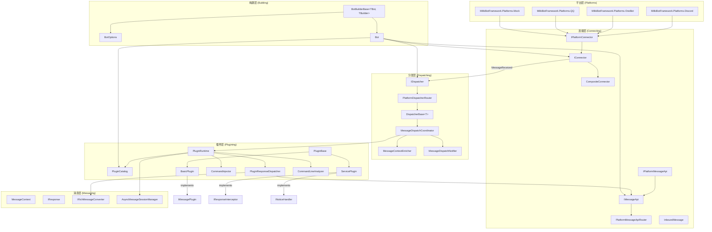
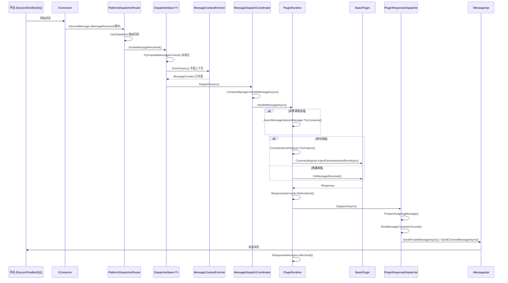
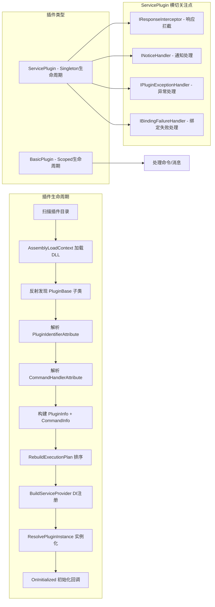
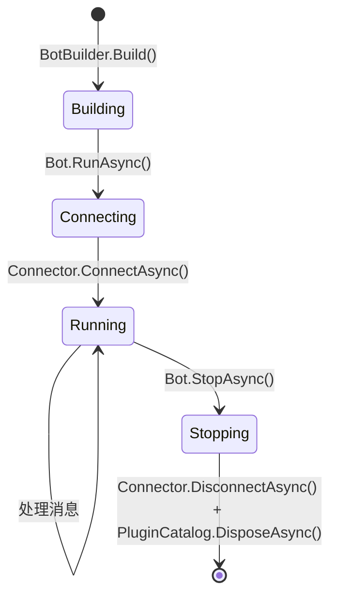

# MilkiBotFramework 架构分析

## 一、项目结构

框架源码位于 `src/`，核心项目结构如下：

| 项目 | 职责 |
|------|------|
| `MilkiBotFramework/` | 核心框架（DI、插件、消息、分发） |
| `MilkiBotFramework.Platforms.Discord/` | Discord 平台适配 |
| `MilkiBotFramework.Platforms.OneBot/` | OneBot 协议适配 |
| `MilkiBotFramework.Platforms.QQ/` | QQ 平台适配 |
| `MilkiBotFramework.Platforms.Mock/` | Mock 测试平台 |
| `MilkiBotFramework.Imaging.Wpf/` | WPF 图像渲染 |
| `MilkiBotFramework.Imaging.Avalonia/` | Avalonia 图像渲染 |
| `MilkiBotFramework.Aspnetcore/` | ASP.NET Core 集成 |

核心依赖：**Autofac**（DI容器）、**YamlDotNet**（配置）、**SixLabors.ImageSharp**（图像处理）、**Fleck/Websocket.Client**（WebSocket通信）、**EntityFrameworkCore.Sqlite**（插件数据库）。

---

## 二、核心架构分层

框架采用 **六层架构**，自底向上为：

### 1. 构建层 — `BotBuilderBase<TBot, TBuilder>`

- **Builder 模式**：通过流畅 API 配置所有组件
- 关键方法：`UseConnector<T>()`、`UseDispatcher<T>()`、`UseMessageApi<T>()`、`UseOptions<T>()`
- `Build()` 时注册所有服务到 Autofac 容器，支持多平台自动路由（单平台直接注册，多平台自动使用 Router）

核心文件：
- [`BotBuilderBase.cs`](../src/MilkiBotFramework/BotBuilderBase.cs)
- [`BotBuilder.cs`](../src/MilkiBotFramework/BotBuilder.cs)
- [`BotOptions.cs`](../src/MilkiBotFramework/BotOptions.cs)
- [`Bot.cs`](../src/MilkiBotFramework/Bot.cs)

### 2. 连接层 — `Connecting/`

- **`IConnector`**：平台连接器接口，定义 `MessageReceived` 事件、`ConnectAsync()`/`DisconnectAsync()`
- **`IPlatformConnector`**：扩展 `IConnector`，增加 `PlatformId` 标识
- **`IMessageApi`**：消息发送接口（私聊/群聊）
- **`CompositeConnector`**：多连接器组合，统一事件源
- **`PlatformMessageApiRouter`**：多平台消息 API 路由，按 `PlatformId` 分发
- **`InboundMessage`**：入站消息封装，包含 `RawText`、`Payload`、`Transport`（平台标识）

核心文件：
- [`IConnector.cs`](../src/MilkiBotFramework/Connecting/IConnector.cs)
- [`IPlatformConnector.cs`](../src/MilkiBotFramework/Connecting/IPlatformConnector.cs)
- [`IMessageApi.cs`](../src/MilkiBotFramework/Connecting/IMessageApi.cs)
- [`IPlatformMessageApi.cs`](../src/MilkiBotFramework/Connecting/IPlatformMessageApi.cs)
- [`CompositeConnector.cs`](../src/MilkiBotFramework/Connecting/CompositeConnector.cs)
- [`PlatformMessageApiRouter.cs`](../src/MilkiBotFramework/Connecting/PlatformMessageApiRouter.cs)
- [`InboundMessage.cs`](../src/MilkiBotFramework/Connecting/InboundMessage.cs)

### 3. 分发层 — `Dispatching/`

- **`IDispatcher`** → `InvokeMessageReceived(InboundMessage)`
- **`PlatformDispatcherRouter`**：多平台分发路由，按 `CanDispatch()` 匹配
- **`DispatcherBase<TMessageContext>`**：平台分发器基类，核心流程：
  1. `TryPopulateMessageContext()` — 将 `InboundMessage` 标准化为 `MessageContext`
  2. `MessageContextEnricher.EnrichAsync()` — 丰富上下文（用户信息、权限等）
  3. `MessageDispatchCoordinator.DispatchAsync()` — 协调分发
- **`MessageDispatchCoordinator`**：编排器，依次执行：
  - `ContactsManager.HandleMessageAsync()` — 联系人管理
  - `PluginRuntime.HandleMessageAsync()` — 插件处理
  - `MessageDispatchNotifier.NotifyAsync()` — 通知外部订阅

核心文件：
- [`IDispatcher.cs`](../src/MilkiBotFramework/Dispatching/IDispatcher.cs)
- [`DispatcherBase.cs`](../src/MilkiBotFramework/Dispatching/DispatcherBase.cs)
- [`PlatformDispatcherRouter.cs`](../src/MilkiBotFramework/Dispatching/PlatformDispatcherRouter.cs)
- [`MessageDispatchCoordinator.cs`](../src/MilkiBotFramework/Dispatching/MessageDispatchCoordinator.cs)
- [`MessageContextEnricher.cs`](../src/MilkiBotFramework/Dispatching/MessageContextEnricher.cs)
- [`MessageDispatchNotifier.cs`](../src/MilkiBotFramework/Dispatching/MessageDispatchNotifier.cs)

### 4. 插件层 — `Plugining/`

这是框架最核心也最复杂的部分：

#### 插件类型体系

- **`PluginBase`**（抽象基类）→ 提供响应工厂方法（`Reply()`、`Handled()`、`ToPrivate()`、`ToChannel()`）
- **`BasicPlugin`**：消息处理插件，**Scoped 生命周期**，实现 `IMessagePlugin`
- **`ServicePlugin`**：服务插件，**Singleton 生命周期**，实现横切关注点接口：
  - `IResponseInterceptor` — 响应发送前/后拦截
  - `INoticeHandler` — 系统通知处理
  - `IPluginExceptionHandler` — 插件异常兜底
  - `IBindingFailureHandler` — 命令绑定失败处理

#### 插件加载机制（`PluginCatalog`）

1. 扫描入口程序集 + `plugins/` 目录下所有子目录的 DLL
2. 使用 `AssemblyLoadContext` 隔离加载（支持热卸载）
3. 反射发现 `PluginBase` 子类，解析 `PluginIdentifierAttribute`（GUID、名称、优先级）
4. 解析 `CommandHandlerAttribute` 构建 `CommandInfo` 映射
5. 按 `Index` 排序构建 **执行计划**（`ExecutionPlan`）
6. 通过 Autofac `ILifetimeScope` 构建 DI 容器
7. Singleton 插件立即实例化并调用 `OnInitialized()`

#### 消息处理流程（`PluginRuntime`）

1. 检查异步消息会话（`AsyncMessageSessionManager`）
2. 命令消息：`CommandLineAnalyzer` 解析 → `CommandInjector` 参数注入 → 执行 `[CommandHandler]` 方法
3. 普通消息：遍历 `BasicPlugin` 调用 `OnMessageReceived()`
4. 响应经过 `ResponseInterceptor` 链 → `PluginResponseDispatcher` → `IMessageApi` 发送
5. 任何 `IResponse.IsHandled = true` 即终止传播

核心文件：
- [`PluginBase.cs`](../src/MilkiBotFramework/Plugining/PluginBase.cs)
- [`BasicPlugin.cs`](../src/MilkiBotFramework/Plugining/BasicPlugin.cs)
- [`ServicePlugin.cs`](../src/MilkiBotFramework/Plugining/ServicePlugin.cs)
- [`IMessagePlugin.cs`](../src/MilkiBotFramework/Plugining/IMessagePlugin.cs)
- [`PluginCatalog.cs`](../src/MilkiBotFramework/Plugining/PluginCatalog.cs)
- [`PluginRuntime.cs`](../src/MilkiBotFramework/Plugining/PluginRuntime.cs)
- [`PluginResponseDispatcher.cs`](../src/MilkiBotFramework/Plugining/PluginResponseDispatcher.cs)
- [`CommandInjector.cs`](../src/MilkiBotFramework/Plugining/CommandInjector.cs)
- [`AsyncMessageSessionManager.cs`](../src/MilkiBotFramework/Plugining/AsyncMessageSessionManager.cs)

### 5. 消息层 — `Messaging/`

- **`MessageContext`**：消息上下文，包含平台ID、用户身份、频道信息、权限、命令解析结果等
- **`IResponse`**：响应接口，支持链式调用（`.Handled()`、`.Forced()`、`.At()`）
- **`IRichMessageConverter`**：富消息编解码（平台特定格式 ↔ 统一模型）
- **`AsyncMessage`**：异步消息会话，支持多轮对话

核心文件：
- [`MessageContext.cs`](../src/MilkiBotFramework/Messaging/MessageContext.cs)
- [`IResponse.cs`](../src/MilkiBotFramework/Messaging/IResponse.cs)
- [`MessageResponse.cs`](../src/MilkiBotFramework/Messaging/MessageResponse.cs)
- [`IRichMessageConverter.cs`](../src/MilkiBotFramework/Messaging/IRichMessageConverter.cs)
- [`IAsyncMessage.cs`](../src/MilkiBotFramework/Messaging/IAsyncMessage.cs)

### 6. 配置层

- **`BotOptions`**：YAML 配置基类，包含命令前缀、Root账号、插件目录、数据库目录等
- **`ConfigurationFactory`**：配置文件加载工厂
- **`Configuration<T>`**：插件配置泛型服务

核心文件：
- [`BotOptions.cs`](../src/MilkiBotFramework/BotOptions.cs)
- [`Plugining/Configuration/`](../src/MilkiBotFramework/Plugining/Configuration/)

---

## 三、整体架构图



---

## 四、消息处理管道流程



---

## 五、插件系统架构



### 插件特性（Attributes）

| 特性 | 目标 | 用途 |
|------|------|------|
| `[PluginIdentifier]` | Class | 标识插件（GUID、名称、优先级、作者） |
| `[PluginLifetime]` | Class | 声明生命周期（Singleton/Scoped） |
| `[CommandHandler]` | Method | 标记命令处理方法，支持权限和消息类型过滤 |
| `[Parameter]` | Method Param | 位置参数绑定 |
| `[Option]` | Method Param | 选项参数绑定 |
| `[Argument]` | Method Param | 参数绑定 |
| `[RegexCommand]` | Class | 正则命令匹配 |

---

## 六、关键设计模式

| 模式 | 应用场景 |
|------|---------|
| **Builder** | `BotBuilderBase` 流畅构建 Bot |
| **Strategy + Router** | 多平台 Connector/Dispatcher/MessageApi 路由 |
| **Plugin** | 插件热加载/卸载，`AssemblyLoadContext` 隔离 |
| **Observer/Event** | `IConnector.MessageReceived` 事件驱动 |
| **Chain of Responsibility** | 插件执行链，`IsHandled` 终止传播 |
| **Interceptor** | `ServicePlugin` 的 `IResponseInterceptor` 前后置拦截 |
| **Template Method** | `DispatcherBase.TryPopulateMessageContext()` 由子类实现 |
| **DI (Autofac)** | 全框架依赖注入，Scoped/Singleton 生命周期管理 |

---

## 七、平台抽象机制

框架通过 **四组接口对** 实现平台抽象，每组都有 Router 自动路由：

```
IConnector          ← IPlatformConnector (带 PlatformId)
IDispatcher         ← IPlatformDispatcher (带 PlatformId)
IMessageApi         ← IPlatformMessageApi (带 PlatformId)
IContactsManager    ← IPlatformContactsManager (带 PlatformId)
```

当注册多个平台时，自动使用 Router（`CompositeConnector`、`PlatformDispatcherRouter`、`PlatformMessageApiRouter`、`PlatformContactsManagerRouter`）按 `PlatformId` 路由。单平台时直接注册，零开销。

已定义的平台标识（`PlatformIds`）：

| 常量 | 值 |
|------|-----|
| `Discord` | `"discord"` |
| `OneBot` | `"onebot"` |
| `Qq` | `"qq"` |
| `Mock` | `"mock"` |

---

## 八、命令系统

- **`CommandLineAnalyzer`**：解析 `/command --option value` 格式命令
- **`[CommandHandler("command")]`**：标记处理方法，支持权限控制和消息类型过滤
- **`[Parameter]`/`[Option]`/`[Argument]`**：参数绑定特性
- **`CommandInjector`**：自动参数注入和类型转换
- **`IParameterConverter`**：自定义参数类型转换器
- 支持 **绑定失败回调**（`OnBindingFailed`）和 **全局绑定失败处理器**

---

## 九、Bot 生命周期



1. **构建阶段**：`BotBuilder` 配置所有组件，注册 DI 服务，调用 `Build()` 创建 `Bot` 实例
2. **连接阶段**：`Bot.RunAsync()` 调用 `Connector.ConnectAsync()` 连接平台
3. **初始化阶段**：`PluginCatalog.InitializeAllPlugins()` 加载并初始化所有插件
4. **运行阶段**：消息通过管道处理，插件响应请求
5. **停止阶段**：`Bot.StopAsync()` 断开连接、释放插件资源

---

## 十、总结

MilkiBotFramework 是一个 **高度模块化、插件驱动、多平台支持** 的聊天机器人框架，核心特点：

1. **清晰的分层架构**：连接 → 分发 → 插件 → 消息，职责分明
2. **灵活的插件系统**：支持热加载/卸载、命令自动绑定、横切关注点分离
3. **优雅的多平台抽象**：Router 模式自动适配单/多平台场景
4. **完善的 DI 支持**：Autofac 深度集成，插件隔离加载
5. **异步消息会话**：支持多轮对话场景
